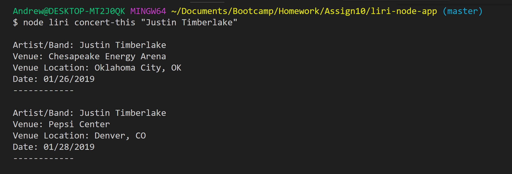
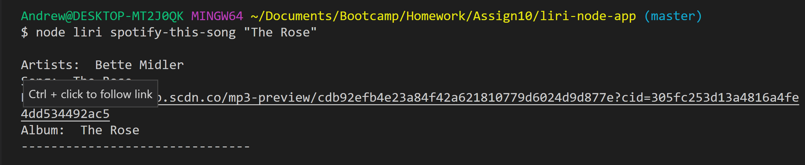
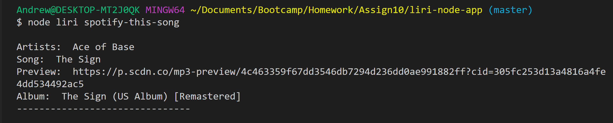

# LIRI Bot

## LIRI Overview

LIRI is like iPhone's SIRI. However, while SIRI is a Speech Interpretation and Recognition Interface, LIRI is a _Language_ Interpretation and Recognition Interface. LIRI will be a command line Node app that takes in four commands and gives you back related data.

LIRI will search Spotify for songs, Bands in Town for concerts, and OMDB for movies.
   
## LIRI User Guide

To use LIRI you must open and use a terminal window.

Issue LIRI a command, from a terminal prompt, following this format:

    $node liri [command] [argument]

Valid LIRI commands are one of the following commands:

   * concert-this
   * spotify-this-song
   * movie-this
   * do-what-it-says

## What Each Command Does

### concert-this

1. node liri.js concert-this [artist or band]

This will search the Bands in Town Artist Events API for an artist and render the following information about each event to the terminal:

    * Artist/Band
    * Name of the venue
    * Venue location
    * Date of the Event 

Example command and results:

### spotify-this-song

1. node liri.js spotify-this-song [song name]

This will search the Spotify API for the song and return the following information about the song to the terminal:

     * Artist(s)
     * The song's name
     * A preview link of the song from Spotify
     * The album that the song is from

If no song is provided then LIRI will search Spotify for "The Sign" by Ace of Base.

Example command and results specifying a song

Example command and results using defualt song

3. node liri.js movie-this [movie-name]

This will search the OMDB API for the movie and return the following information about the movie to the terminal:

    * Title of the movie
    * Year the movie came out
    * IMDB Rating of the movie
    * Rotten Tomatoes Rating of the movie
    * Country where the movie was produced
    * Language of the movie
    * Plot of the movie
    * Actors in the movie

  If the user doesn't type a movie in, LIRI will search for the movie 'Mr. Nobody.'

4.  `node liri.js do-what-it-says`

LIRI will take the text inside of random.txt and then use it to call the specified command inside the random.txt file.

  * It should run `spotify-this-song` for "I Want it That Way" by default.

